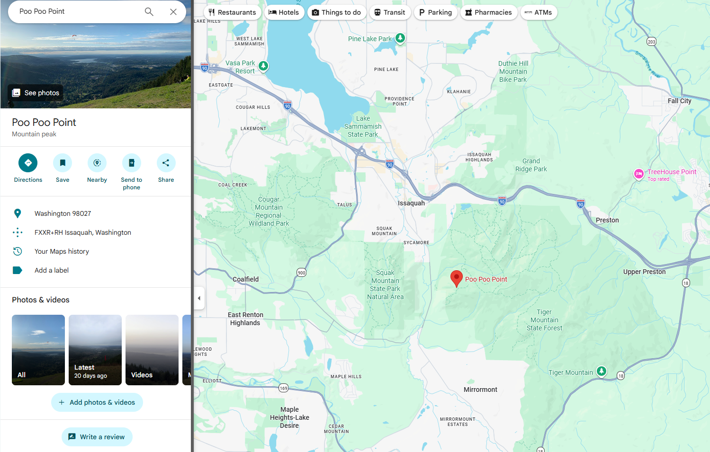
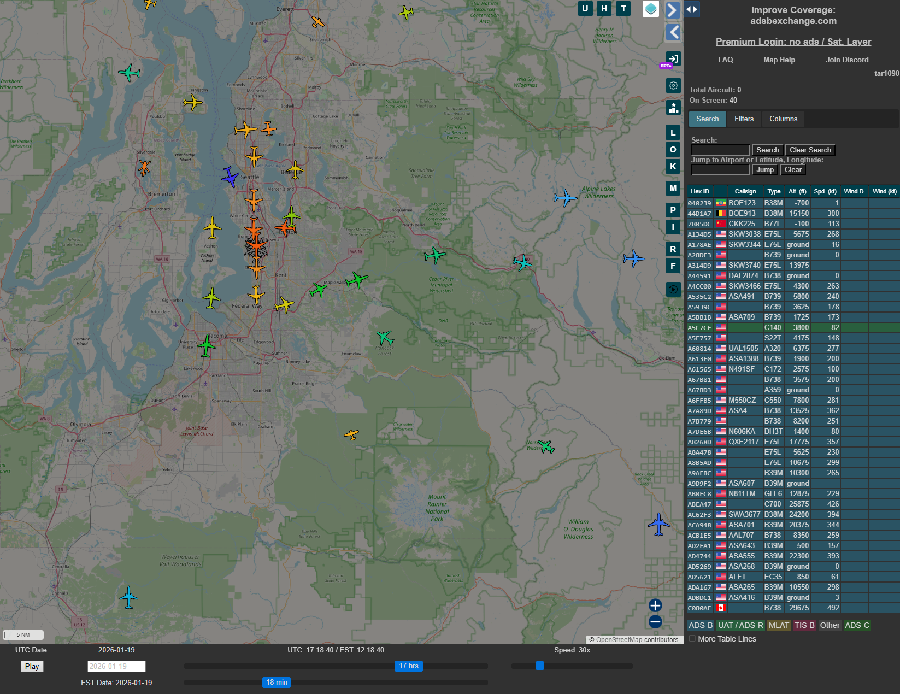
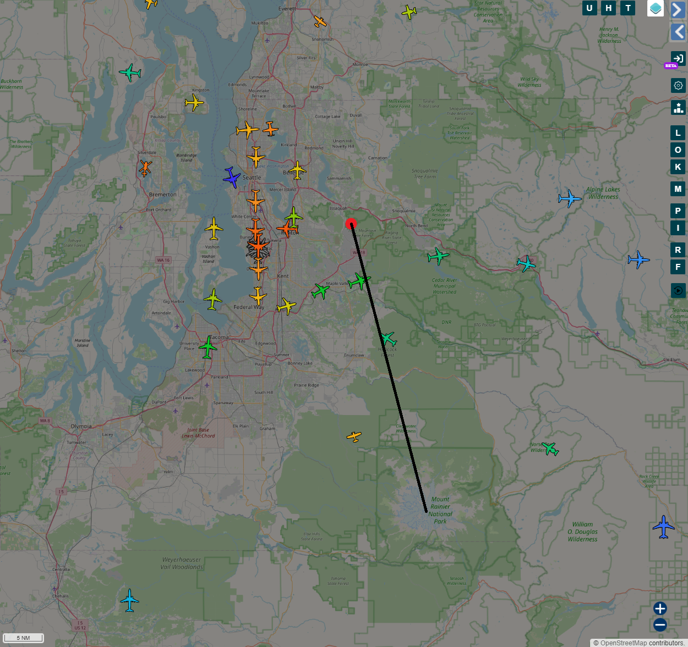
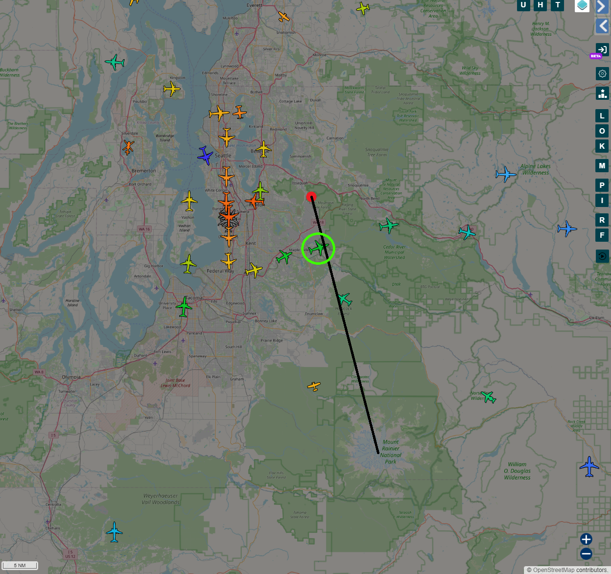
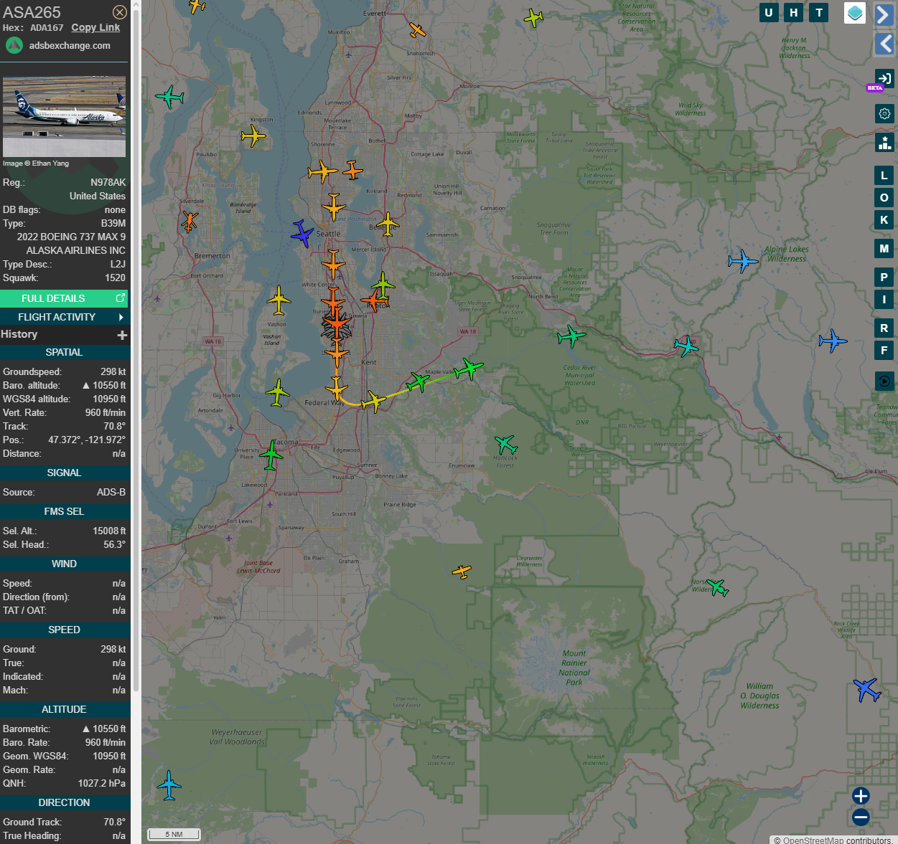
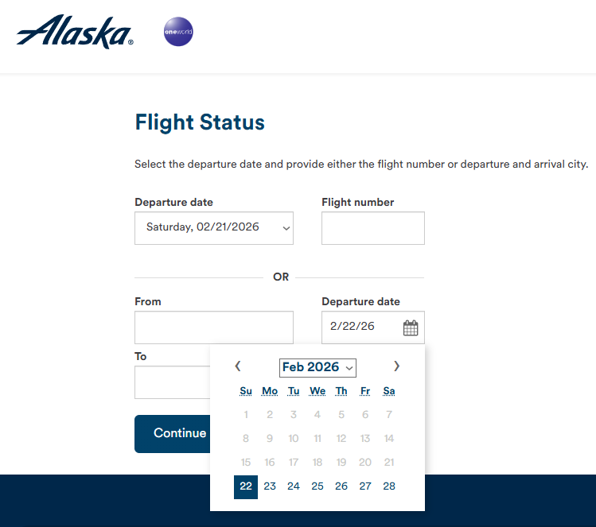
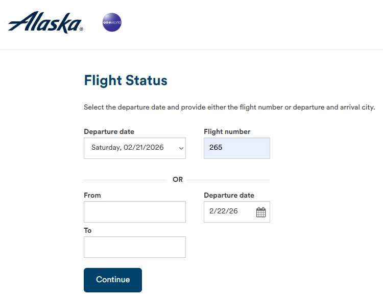
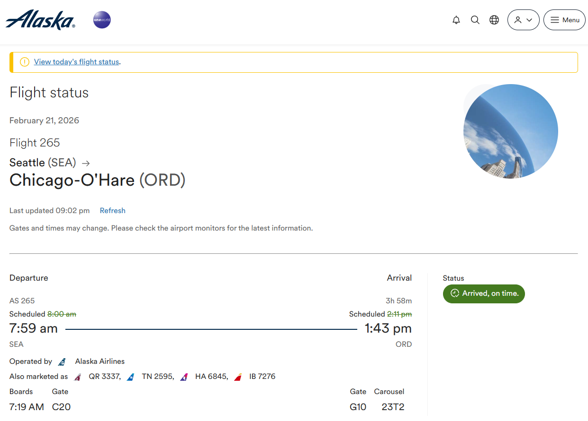
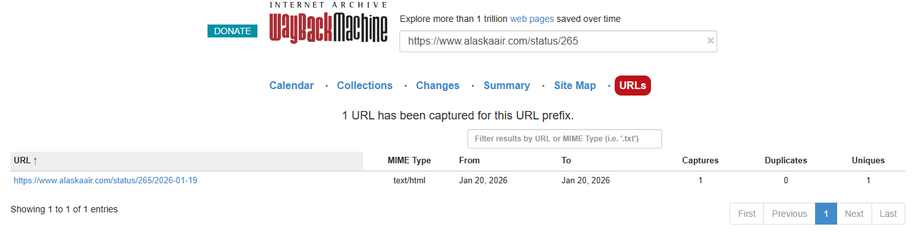
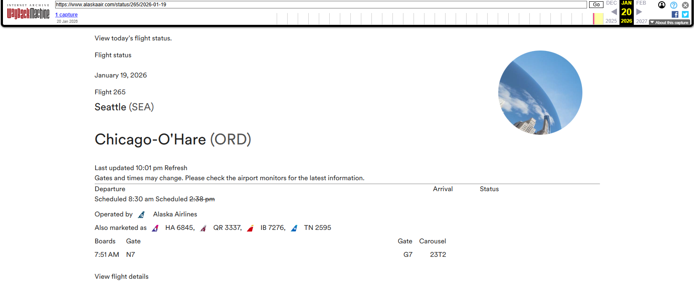

**Batman's Kitchen CTF 2026**

I played Batman's Kitchen CTF 2026 with tjcsc. We got 1st place! 

**Challenge:** Eye on the Sky  
**Category:** OSINT  
**Author:** Aramdana  
**Description:** Flag format is the flight number (as marketed by the operating airline) (w/ no spaces), followed by '-', followed by the baggage carousel number. example : bkctf{DL2949-12C4}  
**Flag:** ``bkctf{AS265-23T2}``  
**Note:** This challenge was the first challenge in a series of two challenges. However, the second challenge had more solves than this first part. I will be explaining this challenge using information gained from the second part.

---


We are given the same image as the second part. It shows a beautiful picture of a mountain of some sort with a plane flying at the top. From the description of the challenge, we need to find the flight number of the plane at the top, as well as the baggage carousel number upon arrival. Interesting!

Well, the information we know from the second part is that the photo was taken from "Poo Poo Point" (interesting name):



We also know that the mountain in the photo is Mount Rainier. This was known from the second part, but can also be confirmed with seeing the numerous photos of Mount Rainier that were taken at Poo Poo Point.

Knowing this, a key question is: "What date and time was this photo taken?" Luckily, the author made it very easy to figure this out. By simply running `exiftool sky.jpg`, we get the following output (cleaned up, only showing important parts):

```
(base) Snowbird91$ exiftool sky.jpg

Date/Time Original              : 2026:01:19 09:18:43
Create Date                     : 2026:01:19 09:18:43
Modify Date                     : 2026:01:19 09:18:43

Create Date                     : 2026:01:19 09:18:43.44
Date/Time Original              : 2026:01:19 09:18:43.44
Modify Date                     : 2026:01:19 09:18:43.44

Time Zone                       : -08:00
Time Zone City                  : Los Angeles
Daylight Savings                : Off
```

Great! Now we know that the picture was taken on January 19th, 2026 at 09:18:43. The timezone shown is Los Angeles and daylight savings is off, meaning the timezone is Pacific Standard Time (PST).

The next question one would ask is, "Now how the hell am I meant to get the flight number from all this?" Ah yes, my inner avgeek shines!

There is a very useful website called ADS-B Exchange. The website uses Automatic Dependent Surveillance-Broadcast (ADS-B) signals. ADS-B is an aviation surveillance technology in which an aircraft determines its location via satellite navigations or other sensors and periodically broadcasts its position and other related data, enabling it to be tracked (thanks Wikipedia!). For my non-avgeeks, it's basically a way to track plane data, including location and flight number. If you've heard of Jack Sweeny and him tracking the private jets of Russian oligarchs, Elon Musk, and Taylor Swift, he uses the same technology.

Anyway, the website displays all the planes and shows all the positions. There is also a nice feature that allows me to planes at a specific date and time:



Wow, that's really useful. Now, let's place a red marker down at Poo Poo Point and draw a line to approximately Mount Rainier to see what planes would have been in view:



Yes! That's very useful. Now, taking into account that the plane is flying left in the photo, we can match it to be this plane circled in green:



Great! Let's see the flight number by clicking on the plane:



We see an Alaska Airlines Boeing 737 Max 9 (door falling off reference?) with flight number ASA265. Great! We've found the flight number now. Let's go find that baggage carousel number.

Doing a quick Google search `alaska airlines flight status`, we get to the official Alaska Airlines website `https://www.alaskaair.com/flightstatus`. There appears to be a calendar option! Maybe we can see the flight status on January 19th, 2026:



Darn. Every date before the current date is greyed out and cannot be selected. Let's just try searching for the flight on a random date to see what we get:





Nice! It appears to be a flight from Seattle (SEA) to Chicago (ORD). We see multiple bits of info, but the most important is the carousel number of `23T2`. Let's try that...

It worked! The final flag was ``bkctf{AS265-23T2}``. What a fun solve!

Side note: My solve for the baggage carousel was not the intended solve. From past experience, I know that flights tend to keep the same baggage carousel day-to-day, which happened coincide here. However, the intended method (as per the author) was to use the Wayback Machine:



Clicking on that option:



We see the same baggage carousel number, but from that exact date. Regardless, you get the same flag! 

---

Thank you for reading my write-up! My team and I had lots of fun working through the challenges. Hats off to the organizers at the University of Washington for hosting such a great first CTF! We will be back next year :)

If there’s anything you think I could improve on in future write-ups, please let me know!

Thank you and have a great day!