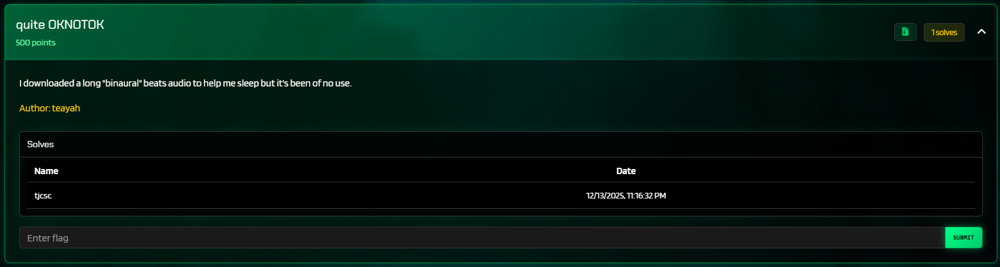
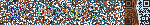
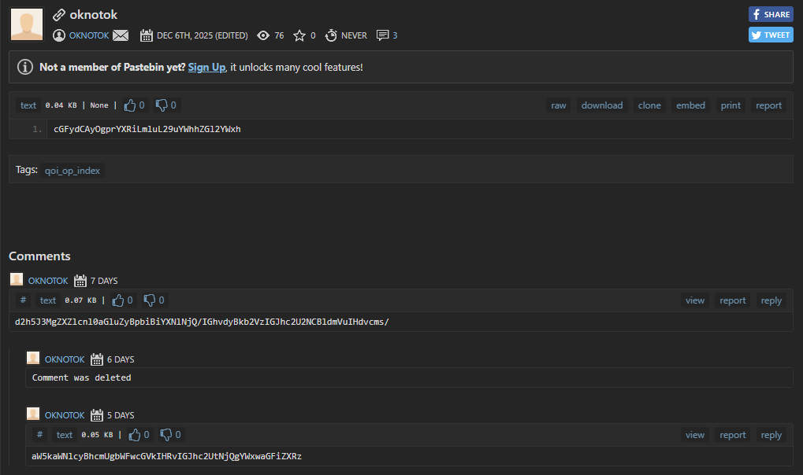
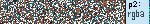
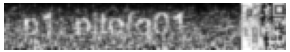

**niteCTF 2025**

I played niteCTF 2025 with tjcsc. We got 1st place! 

**Challenge:** quite OKNOTOK  
**Category:** Forensics  
**Author:** teayah  
**Flag:** ``nite{q01_n0_y0q0an}``  
**Note:** We got first blood for this challenge and we were the only team to solve the challenge in the CTF!



---

## My initial read / first impressions

- We are given a zip file which only contained one file: `binaural_beats` with no extension. No other information was given other than an obscure description: "I downloaded a long "binaural" beats audio to help me sleep but it's been of no use."
- After a bit of googling, I found out that the first 4 bytes of the file were `qoaf` which is the magic for **QOA (Quite OK Audio)**. So that's where **quite OK**NOTOK came from!

---

## Decoding QOA to PCM

So, what is the QOA structure? Well, in a nutshell:
- File header: `qoaf` + total sample count (big-endian).
- Then frames. Each frame has:
  - 8-byte frame header (channels, sample rate, samples in this frame, frame size).
  - LMS predictor state per channel (4 history + 4 weights).
  - Packed slices: each slice is 8 bytes = 4-bit scale + 20×3-bit residuals, 20 samples per slice. Channels are interleaved per slice.

I mirrored the reference spec in Python: apply LMS prediction, dequantize with the 16-value table, and rebuild 16-bit PCM. The file was stereo, 44100 Hz. After decoding I saved `out.wav` just to be sure the audio wasn’t garbage (it sounded like high-pitched warbling instead of sleep music, so THIS is why it's no use...).

---

## Spotting the modulation: 8 FSK carriers

Short FFTs over the audio (~0.1 s windows) showed **eight narrow tones**. Each tone hopped between two frequencies 200 Hz apart — classic 2-FSK. The pairs (low/high) were:

- 7500 / 7700 Hz
- 8500 / 8700 Hz
- 9500 / 9700 Hz
- 10500 / 10700 Hz
- 11500 / 11700 Hz
- 12500 / 12700 Hz
- 13500 / 13700 Hz
- 14500 / 14700 Hz

With a 0.1 s symbol (4410 samples), each carrier gives 1 bit per symbol. I used Goertzel per (low, high) bin; if energy(high) > energy(low) -> bit = 1 else 0. Collect bits from lowest to highest frequency as **MSB -> LSB** to form each byte.

A tiny decoder loop:

```python
import numpy as np
from scipy.signal import get_window

RATE = 44100
SYMSZ = int(0.1 * RATE)
carriers = [(7500+200*i, 7700+200*i) for i in range(8)]

def goertzel(x, f):
    k = int(0.5 + (SYMSZ * f) / RATE)
    w = 2*np.pi*k/SYMSZ
    coeff = 2*np.cos(w)
    s0 = s1 = s2 = 0.0
    for v in x:
        s0 = v + coeff*s1 - s2
        s2, s1 = s1, s0
    return s1*s1 + s2*s2 - coeff*s1*s2

pcm = np.fromfile("out.pcm", dtype=np.int16).reshape(-1, 2)[:,0]  # mono
bytes_out = []
for i in range(0, len(pcm), SYMSZ):
    sym = pcm[i:i+SYMSZ]
    if len(sym) < SYMSZ: break
    bits = []
    for lo, hi in carriers:
        e_lo, e_hi = goertzel(sym, lo), goertzel(sym, hi)
        bits.append(1 if e_hi > e_lo else 0)
    b = 0
    for bit in bits:
        b = (b << 1) | bit
    bytes_out.append(b)
open("modem.bin","wb").write(bytes(bytes_out))
```

`modem.bin` started with `qoif`. Jackpot! This is big news! This appears to be a **QOI image**.

---

## QOI -> hidden.png (there’s a QR hiding on the edge)

Decoding the QOI gave a 150×25 RGB strip.



Visually it’s noisy with a faint QR-looking checkerboard on the right 25 columns. The QR was color-dithered enough that normal scanners failed.

I used a small QR reader to crop the rightmost 25×25 square, binarize by luminance, unmask the modules, and parse version-2 QR codewords directly:

```python
#!/usr/bin/env python3
from __future__ import annotations

import sys
from dataclasses import dataclass
from pathlib import Path

import numpy as np
from PIL import Image

def _luminance(rgb: np.ndarray) -> np.ndarray:
    rgb = rgb.astype(np.float32)
    return 0.299 * rgb[..., 0] + 0.587 * rgb[..., 1] + 0.114 * rgb[..., 2]

def binarize_qr(rgb_crop: np.ndarray) -> np.ndarray:
    lum = _luminance(rgb_crop)
    uniq = np.unique(np.round(lum, 3))
    if len(uniq) <= 32 and float(uniq[-1]) > 150.0:
        thr = float(uniq[-2])
        dark = lum < thr
        return dark
    vals = np.clip(lum.astype(np.int32), 0, 255)
    hist = np.bincount(vals.ravel(), minlength=256).astype(np.float64)
    total = vals.size
    sum_total = np.dot(np.arange(256), hist)
    sum_b = 0.0
    w_b = 0.0
    max_var = -1.0
    thr = 128
    for t in range(256):
        w_b += hist[t]
        if w_b == 0:
            continue
        w_f = total - w_b
        if w_f == 0:
            break
        sum_b += t * hist[t]
        m_b = sum_b / w_b
        m_f = (sum_total - sum_b) / w_f
        var_between = w_b * w_f * (m_b - m_f) ** 2
        if var_between > max_var:
            max_var = var_between
            thr = t
    return lum <= thr

ECL_MAP = {
    0b00: "M",
    0b01: "L",
    0b10: "H",
    0b11: "Q",
}

def _format_codeword(ecl_bits: int, mask: int) -> int:
    data = ((ecl_bits & 0x3) << 3) | (mask & 0x7) 
    g = 0x537
    v = data << 10
    for i in range(14, 9, -1):
        if (v >> i) & 1:
            v ^= g << (i - 10)
    remainder = v & 0x3FF
    code = (data << 10) | remainder
    code ^= 0x5412
    return code

FORMAT_TABLE = [(_format_codeword(ecl, m), ecl, m) for ecl in range(4) for m in range(8)]

def read_format_bits_top_left(mod: np.ndarray) -> int:
    bits = []
    for c in range(0, 6):
        bits.append(int(mod[8, c]))
    bits.append(int(mod[8, 7]))
    bits.append(int(mod[8, 8]))
    bits.append(int(mod[7, 8]))
    for r in range(5, -1, -1):
        bits.append(int(mod[r, 8]))
    v = 0
    for b in bits:
        v = (v << 1) | b
    return v

def hamming(a: int, b: int) -> int:
    return (a ^ b).bit_count()

@dataclass
class QRFormat:
    ecl_bits: int
    mask: int

def decode_format(mod: np.ndarray) -> QRFormat:
    v = read_format_bits_top_left(mod)
    best = None
    for code, ecl, mask in FORMAT_TABLE:
        d = hamming(v, code)
        if best is None or d < best[0]:
            best = (d, ecl, mask)
    assert best is not None
    dist, ecl_bits, mask = best
    return QRFormat(ecl_bits=ecl_bits, mask=mask)

def build_function_mask(version: int, N: int) -> np.ndarray:
    func = np.zeros((N, N), dtype=bool)
    finders = [(0, 0), (0, N - 7), (N - 7, 0)]
    for r0, c0 in finders:
        for r in range(r0 - 1, r0 + 8):
            for c in range(c0 - 1, c0 + 8):
                if 0 <= r < N and 0 <= c < N:
                    func[r, c] = True
    func[6, :] = True
    func[:, 6] = True
    if version == 2:
        cy = cx = 18
        for r in range(cy - 2, cy + 3):
            for c in range(cx - 2, cx + 3):
                func[r, c] = True
    func[8, 0:9] = True
    func[0:9, 8] = True
    func[8, N - 8 : N] = True
    func[N - 8 : N, 8] = True
    func[4 * version + 9, 8] = True
    return func

def mask_condition(mask: int, r: int, c: int) -> bool:
    if mask == 0:
        return (r + c) % 2 == 0
    if mask == 1:
        return r % 2 == 0
    if mask == 2:
        return c % 3 == 0
    if mask == 3:
        return (r + c) % 3 == 0
    if mask == 4:
        return ((r // 2) + (c // 3)) % 2 == 0
    if mask == 5:
        return ((r * c) % 2 + (r * c) % 3) == 0
    if mask == 6:
        return (((r * c) % 2 + (r * c) % 3) % 2) == 0
    if mask == 7:
        return (((r + c) % 2 + (r * c) % 3) % 2) == 0
    raise ValueError("invalid mask")

def extract_codewords(mod_dark: np.ndarray, fmt: QRFormat) -> list[int]:
    N = mod_dark.shape[0]
    version = (N - 17) // 4
    func = build_function_mask(version, N)
    m = mod_dark.copy().astype(np.uint8)
    for r in range(N):
        for c in range(N):
            if func[r, c]:
                continue
            if mask_condition(fmt.mask, r, c):
                m[r, c] ^= 1
    bits: list[int] = []
    col = N - 1
    upward = True
    while col > 0:
        if col == 6:
            col -= 1
        rows = range(N - 1, -1, -1) if upward else range(N)
        for r in rows:
            for c in (col, col - 1):
                if func[r, c]:
                    continue
                bits.append(int(m[r, c]))
        upward = not upward
        col -= 2
    codewords: list[int] = []
    for i in range(0, len(bits) // 8 * 8, 8):
        b = 0
        for j in range(8):
            b = (b << 1) | bits[i + j]
        codewords.append(b)
    return codewords

def decode_qr_payload(mod_dark: np.ndarray) -> str:
    fmt = decode_format(mod_dark)
    codewords = extract_codewords(mod_dark, fmt)
    data_cw = codewords[:28]  
    bits = []
    for b in data_cw:
        for i in range(7, -1, -1):
            bits.append((b >> i) & 1)
    def read(n: int) -> int:
        nonlocal bits
        v = 0
        for _ in range(n):
            v = (v << 1) | bits.pop(0)
        return v
    length = read(8)  
    out = bytearray()
    for _ in range(length):
        out.append(read(8))
    return out.decode("utf-8", errors="replace")

def main() -> int:
    img_path = Path(sys.argv[1])
    rgb = np.array(Image.open(img_path).convert("RGB"))
    h, w, _ = rgb.shape
    crop = rgb[:, w - h : w, :]
    mod_dark = binarize_qr(crop)
    payload = decode_qr_payload(mod_dark)
    print(payload)
    return 0

if __name__ == "__main__":
    raise SystemExit(main())
```

Run it:

```
python3 qr_decode_from_hidden.py hidden.png
# -> pastebin.com/kdhd1pSD
```

---

## The Pastebin (how many parts are there?!)

Opening the Pastebin link gives you this



We have three ciphertexts:
- `cGFydCAyOgprYXRiLmluL29uYWhhZGl2YWxh`
- `d2h5J3MgZXZlcnl0aGluZyBpbiBiYXNlNjQ/IGhvdyBkb2VzIGJhc2U2NCBldmVuIHdvcms/`
- `aW5kaWNlcyBhcmUgbWFwcGVkIHRvIGJhc2UtNjQgYWxwaGFiZXRz`

Decoding them from Base64 resulted in:
- `part 2: katb.in/onahadivala`
- `why's everything in base64? how does base64 even work?`
- `indices are mapped to base-64 alphabets`

Hmm, interesting. The second and third seem to be clues. What is the first link about..?

---

## The katb.in detour: another QOI and a column hash

The katb page held a huge `<code>` block. Pulling it and base64-decoding produced another QOI (`data.bin`). Decoding that gave a second 150×24-ish image.



It appears to say `p2: rgba`. How do I use this?

- At this point we stopped treating the second QOI as “just an image” and read the QOI spec. QOI decoders maintain a 64-slot pixel cache, and every decoded pixel is inserted at a deterministic index:
  - `idx = (r*3 + g*5 + b*7 + a*11) % 64`
- That produces values in the range 0-63, which matched the Pastebin hints ("indices are mapped to base‑64 alphabets" and "Tags: qoi_op_index"). So we took the rightmost column’s pixels, computed this QOI index for each one, mapped 0-63 through the Base64 alphabet, and base64-decoded the resulting string to get:

```
part 2: n0_y0q0an}
```

So we now had the tail of the flag. We just have to find the first half!

---

## Reconstructing the front half

Comparing `hidden.png` (from the audio) and `decoded1.png` (from katb) showed almost identical “snow,” except a few colored specks in `hidden.png`. A light Gaussian blur over those differences spelled out:



```
nite{q01
```

Cool! I see the first half and the second half. Stitching the two halves together gave the full flag: `nite{q01_n0_y0q0an}`. Woo! That was a fun challenge, and we got first blood!

---

## Takeaways

- Study QR codes, they are super fascinating!
- Steganography can be as simple as “two almost-identical images, blur the difference.”

Thank you for reading my write-up! This was an extremely fun CTF, and I would like to express my appreciation to the organizers for hosting the CTF!

If there’s anything you think I could improve on in future write-ups, please let me know!

Thank you and have a great day!