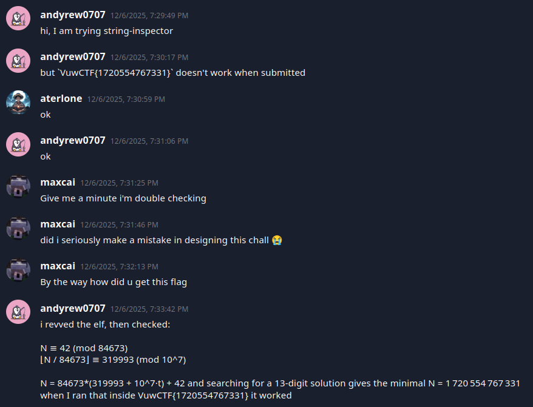
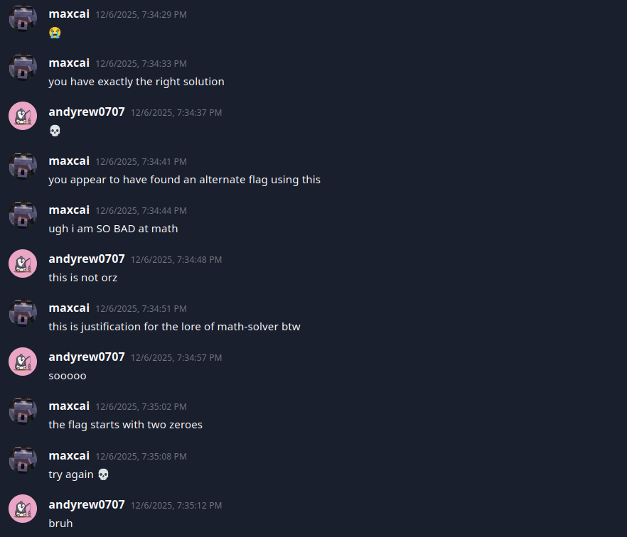

**Vuw CTF 2025**

I played Vuw CTF 2025 with tjcsc. We got 5th place!

**Challenge:** string-inspector  
**Category:** Reverse Engineering  
**Author:** maxster  
**Flag (intended):** ``VuwCTF{0027094767331}``  
**Alt flag I stumbled on first:** ``VuwCTF{1720554767331}`` (binary accepts it, but the author marked it unintended)

---

## My initial read / first impressions

There was only one file given: a binary. I always start by seeing what I’m dealing with:

```
chmod +x inspector
file inspector
# ELF 64-bit LSB executable, x86-64, statically linked, stripped
```

Running it with no arguments:

```
./inspector
# Enter flag as argument to this program
```

So it expects the flag on the command line. Before diving into a disassembler, I like to skim the readable parts:

```
strings -n 6 inspector | head
# Flag rejected!
# Flag accepted!
# Analyzing flag: %s
# VuwCTF{
# 0000000000042
# 0319993
```

The `VuwCTF{` plus the two numeric strings (`0000000000042` and `0319993`) looked like check constants. My instinct felt like the flag would be `VuwCTF{<digits>}` with some math involving those numbers.

---

## Recon: what does it actually do?

First, I tried a dummy flag:

```
./inspector VuwCTF{testflag}
# Analyzing flag: VuwCTF{testflag}
# Flag rejected!
```

To see *how* it rejects, I watched the syscalls with `strace`:

```
strace -f ./inspector VuwCTF{0000000000042} 2>&1 | head -n 40
```

The interesting part of the trace:

```
execve("./inspector", ["./inspector", "VuwCTF{0000000000042}"], ...) = 0
...
execve("./inspector", ["./inspector", "0000000000042", "0000000"], ...) = 0
...
write(1, "Flag rejected!\n", 15) = 15
```

After checking the wrapper, it immediately re-executes itself with **three arguments**: the digits-only string and a helper string of seven zeroes. That’s very useful info! The real verification logic runs in this “three-argument” mode, and the initial run is just a wrapper.

---

## Disassembly: wrapper mode

Opening it in GDB and disassembling around the entry point (`0x401790`):

```
gdb -q ./inspector
(gdb) disassemble 0x401790,0x401950
```

The wrapper logic (as I understood it) was:
- If you don’t give at least one arg, it prints “Enter flag…” and exits.
- In this mode it wants exactly one arg.
- It checks:
  - total length is 21,
  - the string starts with `VuwCTF{` and ends with `}`,
  - the 13 characters inside are all digits.
- On failure, it prints “Flag rejected!”.
- On success, it calls:

```
execve(argv[0], [argv[0], digits_only, "0000000"], NULL);
```

Then it exits. So the first run is just input validation and argument rewriting.

---

## The real checker: manual long division

The second run (with digits + seven zeroes) is where the work happens. Disassembling around `0x4018d0` to `0x401a40` shows a hand-rolled long division on the decimal string:

- It divides the decimal string by the constant **84673**. There isn't anything fancy here. The code literally iterates the characters like you would do on paper: bring down a digit, compute a quotient digit, carry the remainder.
- While dividing, it builds two strings:
  - A **remainder** string, zero-padded to 13 digits.
  - A **quotient suffix** string holding the last 7 digits of the quotient.
- When done, it compares those strings against hard-coded targets in `.rodata`:
  - remainder must be `0000000000042` (i.e., remainder 42),
  - quotient tail must be `0319993` (i.e., quotient ≡ 319993 mod 10^7).
- If both match, it prints “Flag accepted!”, otherwise “Flag rejected!”.

You can see the constants directly:

```
objdump -s -j .rodata inspector | sed -n '0x7f040,0x7f080p'
# shows "VuwCTF{", "0000000000042.", nearby bytes

gdb> x/s 0x47f052
# "0000000000042"

gdb> x/gx 0x401989
# 0x33393939313330  -> little-endian ASCII "0319993\0"
```

The multiple `execve` calls in the earlier `strace` make sense now: the binary keeps re-launching itself while it walks the digits and builds those strings.

---

## Solving the math

Let `N` be the 13-digit number inside the braces.

From the code we need:
1. `N ≡ 42 (mod 84673)`
2. `⌊N / 84673⌋ ≡ 319993 (mod 10^7)`
3. `N` renders as exactly 13 decimal characters. Because the binary keeps the literal string, leading zeroes are allowed and significant.

Write `N = 84673 * Q + 42`, where `Q ≡ 319993 (mod 10^7)`.

So `Q = 319993 + 10^7 * t` for some integer `t ≥ 0`, and:

```
N = 84673 * (319993 + 10_000_000 * t) + 42
```

I checked small `t` with a tiny Python snippet:

```python
mod = 84673
req_q = 319993
req_r = 42
for t in range(0, 5):
    n = mod * (req_q + t*10_000_000) + req_r
    s = f"{n:013d}"
    print(t, n, s)
```

Output:

```
0 27094767331 0027094767331
1 873824767331 0873824767331
2 1720554767331 1720554767331
```

All three are 13 characters long. Because the checker treats the decimal string literally, **all three pass the division checks**.

---

## The detour: unintended flag (not orz, braincell loss)

I initially tried the “clean” non-leading-zero version:

```
./inspector VuwCTF{1720554767331}
# Flag accepted!
```

I submitted that to the CTF website, but it did not work... So I did what any dumb person would do: proceed to doubt myself when I literally had two other possible answers. 

After a few crash outs, I made a ticket. I'll let the conversation speak for itself:




This confirmed I *did* solve it correctly, but I had an alternate flag. Max, if you're reading this, in the future please include all possible flags as correct answers 😭

At least now, I knew the intended flag "starts with two zeros". Well, now I knew what the flag was. Trying the only answer with two leading zeros:

```
./inspector VuwCTF{0027094767331}
# Flag accepted!
```

That was the official flag! The final flag was: ``VuwCTF{0027094767331}``. 

Other than both Max and I losing some braincells, it was a pretty fun challenge!

---

## Takeaways

- Start with the easy triage: `file`, `strings`, and `strace` can reveal control-flow tricks (here, self-`execve`) before you open a disassembler.
- Even stripped static binaries leak constants in `.rodata`; spotting ASCII gives you the targets to aim for.
- If a checker treats input as a string, leading zeroes can produce multiple “valid” answers. If a platform rejects your locally accepted flag, consider the exact formatting the code expects (and don't hesitate to make a ticket for clarification).

Thank you for reading my write-up! This was an extremely fun CTF, and I would like to express my appreciation to the organizers for hosting the CTF

If there’s anything you think I could improve on in future write-ups, please let me know!

Thank you and have a great day!
