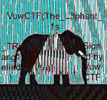

**VuwCTF 2025**

I played VuwCTF 2025 with tjcsc. We got 5th place!

**Challenge:** trianglification  
**Category:** Reverse Engineering  
**Author:** Aterlone  
**Flag:** ``VuwCTF{The_L3phant_1s_TRiang1efied}``

---

## My initial read / first impressions

There were two files that were provided:
- `triangle_xor` (Mach-O arm64 executable, arm64 only)
- `output.jpeg`

I always run a quick recon on the given files:

```
$ file triangle_xor
# Mach-O 64-bit arm64 executable, flags:<NOUNDEFS|DYLDLINK|PIE ...>

$ strings -n 6 output.jpeg | head
# (there wasn't anything useful, just some basic JPEG stuff)
```

On the other hand, running `strings triangle_xor` showed a lot of interesting info. There appeared to be a lot of OpenCV symbols (`cv::imread`, `cv::imwrite`), and a few funny messages:

```
Random masks:
Above:  0x
Right:  0x
Left:   0x
Under:  0x
Inside: 0x
input.jpeg
output.jpeg
Error: Could not load input.jpeg
Saved output.jpeg
```

Based on all this so far, I thought that the program reads an image, scrambles it with some “masks”, and writes `output.jpeg`. So I ran `objdump` to dump the `__text` section into a file tp browse `rg`/`sed`:

```
objdump -d triangle_xor > disasm_all.txt
```

---

## Recon: what is this program actually doing?

Early in the text section there are three helpers on `cv::Point<int>`:
- `same_side(p1, p2, a, b)` this seems to be a basic cross-product side test
- `midpoint(p1, p2)`
- `is_inside_triangle(p, a, b, c)` this calls `same_side` three times

Based on this, geometry is definitely involved. Keeping that in mind, I dug into `_main` (starts at `0x100001adc`).

---

## Walking through main (arm64) - the interesting parts

Based on the file, here's what the program does:

1. **Five random bytes**  
   Seed with `time(NULL)` and call `rand()%256` five times. They’re stored at stack offsets `-0x15..-0x19`. These are the “mask” bytes printed with the “Random masks:” labels (but the program never shows the actual values to us).

2. **Load image**  
   Calls `cv::imread("input.jpeg", 1)`. If empty, prints `Error: Could not load input.jpeg` and exits. The provided `output.jpeg` is already the encoded / scrambled version. For this challenge, we never got `input.jpeg`, so it seems that the goal is to invert the scramble and get the flag from the original `input.jpeg`.

3. **Build triangle + region thresholds** (using `midpoint` and `is_inside_triangle`)  
   For an image of size 179×168 (confirmed later), it sets:
   ```
   P1 = (w/2, h/2 - 0x28) = (89, 44)
   P2 = (w/2-40, h/2 + 0x28) = (49, 124)
   P3 = (w/2+40, h/2 + 0x28) = (129, 124)
   mid12 = (69, 84)
   mid23 = (89, 124)
   mid31 = (109, 84)
   ```
   These midpoints define four rectangular regions: left (x < 69), right (x > 109), above (y < 84), under (y > 124). The triangle inside test uses P1/P2/P3.

4. **Per-pixel loop**  
   For each `(x,y)`:
   - Booleans: `b_left`, `b_right`, `b_above`, `b_under`, `b_inside`.
   - Start `key = 0`.  
     If `b_left`   → `key ^= rand1` (at `-0x15`)  
     If `b_right`  → `key ^= rand2` (at `-0x16`)  
     If `b_above`  → `key ^= rand3` (at `-0x17`)  
     If `b_under`  → `key ^= rand4` (at `-0x18`)  
     If `b_inside` → `key ^= rand5` (at `-0x19`)
   - Compute `val = (key * x - y) & 0xFF`.
   - XOR `val` into each channel and store to the output Mat.

5. **Save**  
   Writes `output.jpeg` with the scrambled pixels.

In essence, the whole thing is a XOR mask over the image, where the only unknowns are those five bytes. Geometry and thresholds are fixed by the image size.

So the protection is a geometric XOR mask, with five unknown bytes (the `rand()%256` outputs). All region boundaries are fixed by the image dimensions.

---

## Recovering the mask bytes (a small puzzle)

Because the five bytes are random per run, we need to **solve for them** given only the final `output.jpeg`. The transform per pixel:

```
C_out = C_in ^ ((mask * x - y) & 0xFF)
```

The boolean structure lets you isolate each byte by comparing regions that differ in only one flag. A quick search yielded a clean, consistent set:

```
A = 27   # above y < 84
L = 57   # left  x < 69
R = 181  # right x > 109
U = 225  # under y > 124
I = 0    # inside triangle (not used)
```

With those, the mask is fully determined and the inside-byte doesn’t matter (it was 0 in the solved run). The geometry practically gives you the linear equations so there's no need to brute force :)

---

## Decoding (inverse transform)

I wrote a standalone decoder mirroring the binary’s logic (coordinates and midpoints computed from the image itself):

```python
#!/usr/bin/env python3
from PIL import Image
import numpy as np

IN_FILE = "output.jpeg"
OUT_FILE = "decrypted_I0.png"

A, L, R, U, I = 27, 57, 181, 225, 0
img = np.array(Image.open(IN_FILE), dtype=np.uint8)
h, w, _ = img.shape
xs, ys = np.meshgrid(np.arange(w, dtype=np.int16), np.arange(h, dtype=np.int16))
P1 = (w // 2, h // 2 - 40)
P2 = (w // 2 - 40, h // 2 + 40)
P3 = (w // 2 + 40, h // 2 + 40)
mid12 = ((P1[0] + P2[0]) // 2, (P1[1] + P2[1]) // 2)
mid23 = ((P2[0] + P3[0]) // 2, (P2[1] + P3[1]) // 2)
mid31 = ((P3[0] + P1[0]) // 2, (P3[1] + P1[1]) // 2)
above = ys < mid12[1]
under = ys > mid23[1]
left = xs < mid12[0]
right = xs > mid31[0]
ax, ay = P1; bx, by = P2; cx, cy = P3
inside = (((by - cy) * (ys - cy) + (bx - cx) * (xs - cx)) >= 0)
inside &= (((cy - ay) * (ys - ay) + (cx - ax) * (xs - ax)) >= 0)
inside &= (((ay - by) * (ys - by) + (ax - bx) * (xs - bx)) >= 0)
inside = inside.astype(np.uint8)
mask = np.zeros((h, w), dtype=np.uint8)
mask ^= np.where(above, A, 0).astype(np.uint8)
mask ^= np.where(under, U, 0).astype(np.uint8)
mask ^= np.where(left, L, 0).astype(np.uint8)
mask ^= np.where(right, R, 0).astype(np.uint8)
if I:
    mask ^= (inside * I).astype(np.uint8)
val = (mask.astype(np.int16) * xs - ys) & 0xFF
dec = (img ^ val[:, :, None]).astype(np.uint8)
Image.fromarray(dec).save(OUT_FILE)
print("Saved", OUT_FILE)
```

Run it:

```
$ python3 decode.py
# Saved decrypted_I0.png
```

Opening `decrypted_I0.png` shows some pixelated text:



Great! I see the flag header. After a bit of OCR, I got the final flag: ``VuwCTF{The_L3phant_1s_TRiang1efied}``. Nice!

Thank you for reading my write-up! This was an extremely fun CTF, and I would like to express my appreciation to the organizers for hosting the CTF!

If there’s anything you think I could improve on in future write-ups, please let me know!

Thank you and have a great day!


